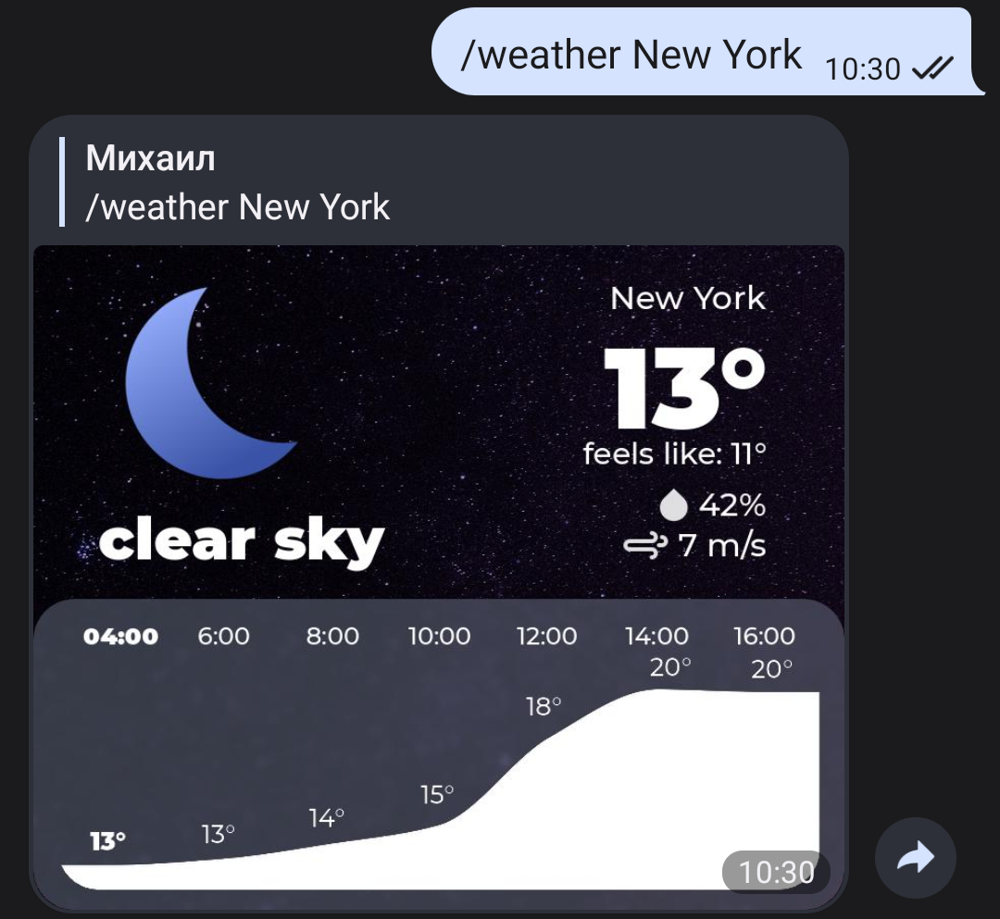

<h1 align="center">VWapi</h1>

[](https://sonarcloud.io/dashboard?id=mishailovic_VWapi)
[](https://github.com/mishailovic/VWapi/issues)
[](https://github.com/mishailovic/VWapi/network)
[](https://github.com/mishailovic/VWapi/stargazers)
[](https://github.com/mishailovic/VWapi/blob/master/LICENSE)


<p align="center">Visual Weather api. Returns beautiful pictures with the current weather.
</p>


# Installation:

```bash
sudo apt update -y && sudo apt upgrade -y
sudo apt install -y git python3 python3-pip 
git clone https://github.com/mishailovic/VWapi
cd VWapi
pip3 install -r requirements.txt
python3 -m uvicorn weatherapi:app
```

# Usage:

```python
import requests
import time
from PIL import Image
import io
language = "en" # can be "en" or "ru"
place = "Moscow" # can be any city, place, street, or site, geocoder automatically selects location. 
timestamp = round(time.time()) # optional timestamp, can be any unix timestamp from now, to now + three days 
r = requests.get(f"https://vwapi.mxf.su?lang={language}&city={place}&timestamp={timestamp}")
image = Image.open(io.BytesIO(r.content))
image.show()
```

# Notes about performance
## StreamingResponse
Usually StreamingResponse is slower than Response, but it depends on the environment where VWapi is gonna be deployed, run some tests before and after using StreamingResponse and see which one has better performance.

If you want to use StreamingResponse set `USE_STREAMING_RESPONSE` environment variable to `true`.

# Telegram bot setup

<details>
  <summary>Demo</summary>
  
  
  
  
  
</details>

You can also setup your own copy of [@visualweatherbot](https://t.me/visualweatherbot)

First, install mogodb, and create directory with database. (If you don't need analytics you can skip this step)

```bash
sudo apt install mongodb-server
sudo mkdir /data
sudo mkdir /data/db
```
Run ```mongo```, copy the connection url, and put it in ```config.py```. Then, talk with [@botfather](https://t.me/botfather) and get your telegram botapi token, you also need to put it in ```config.py```. 

Now, form repo directory run: 
```bash
pip3 install -r requirements.txt
python3 bot.py
```
Your telegram bot is ready.

# Localisation
Currently supported languages: "en", "ru"
If you wish to add your own language, you can easily edit few lines in [/utils/constants.py](https://github.com/mishailovic/VWapi/blob/master/utils/constants.py#L3) and make pull request.

# Credits:
render.py based on https://github.com/adrian-kalinin/TeleWeatherRobot/blob/master/bot/utils/render.py 
Huge thanks to its developer @adrian-kalinin  

Thx to @notmyst33d for https://github.com/notmyst33d/Dripcons

All [contributors](https://github.com/mishailovic/VWapi/graphs/contributors) of this project.
